# tapable-tracer

Trace the connections and flows between
[tapable](https://github.com/webpack/tapable) hooks in real-time.

Collect structured stack traces, and optionally export them as UML diagrams.

## Table of Contents

- [Overview](#overview)
- [Features](#features)
- [Installation](#installation)
- [Usage](#usage)
  - [Initialize Tracer](#initialize-tracer)
  - [Register Hooks](#register-hooks)
  - [Export Frames](#export-frames)
  - [Generate UML](#generate-uml)
  - [Tracer Internals](#tracer-internals)
- [Configuration](#configuration)
  - [Global Options](#global-options)
  - [Per-Hook Options](#per-hook-options)
- [Technical Details](#technical-details)
  - [Examples](#examples)
- [License](#license)

## Overview

Have you ever wondered what the internals of webpack look like?
Below is a UML-style representation of webpack's internal hooks captured at
runtime. This diagram was generated using the `tapable-tracer` and its
[webpack plugin](src/extensions/webpack/plugin/TapableTracerPlugin.ts) by
tracing dynamically every hook tap and call in the system.

<picture>
  <source
    media="(prefers-color-scheme: dark)"
    srcset="./assets/webpack-graph-dark.svg"
  />
  
</picture>

View the full interactive version here:
- [Mermaid Chart Playground](https://www.mermaidchart.com/play#pako:eNqlmttOKzcUhl8l4h4JcgQuKqEQukPJBhEQlTZblZk4icWMZ2p70E5L36aXfao-Sb2cAznYnlmrV1HGXt_YXr9Pv-bPoySf8KOLo-Pj4xeZ5HIqZhcvstFI2SIvzUWDp2_w1_64x42GtPXvU5bwjEszNooZPltcNL4OHp_vHn75bTwc3d8Ofn2RDjhTrJg3bh8gFAJPvn1rfLW_A_kuVC4BcZ-WMyEb3783jo9_-jCs-HA1T23NVz7NFX8ooXRNaNrnj6xgryl_VLYVKhDfsvUmueRboW376N9__l5XTViaLut2bAH_bFGdkK4tYFPD1cAb17PFgx-2WLJUB1p4ZuskeVaIdLuR5_Zpf17Kt3vFp9wkc_ub5mwSGqaTDYUZkW-P1CkMYT_PslzeaIe8zlXGggMOI2vmQvf9NBjQsWHKlIWDXfGCywmXieCaiGzvN_DWdlTIGREHaeynnMlQPCSNZ2I7UaeQqRv2znSiRGFG-aRMw_2JDDZk80bnkk6AzF9qzemNaELRQBq1uCugKEBonjq9b6rV0XskxlO0fJ8SsxlXH_GmbSjNdQVCv6timyDejL1tT7Qm9NWuLUZknPBKENtQTrm61AuZ0FMGmrxihj0pQYgG9V7bBYQWfbacf4UteBWpMJShB9V-YcrO4QV5EFpQdDm6IkSC9h7476VQ_EaPTTmdEiDNrXWIEA7igpUruBfFgturHZHadtDh5f2QENl1e1SRK6OtkPPLgiChFgjwmb8WLHkbWkySlhNO2KtaSylKbQixIMEnbUdQiYQQ3z751NCqBwTIlhAHUpeKwmh-MuxYGP6D0htQ4zCDtBKC25vgETeM3ghQ5XihDc8Iwd2dRhAAIMqnh1tCJMjwOVdv4akcP4O0QYtXfMrK1J6NmdHXLDE5ZU_rnOyR7DnQng0IoNMDkLBpJaxVnebuWckmBxYOAqjl9muYJe7YZ3U2EVCHsPp23DbOs_ydD7LCLByQwgHJjria8auySEVirzVkFAj4OmWz9XpIBoGQx8Jel6ZTnlgxWSaBcrZqzubEvlgt-wTW-QHrSbMZYbHrnrgDlOTqZ7gjEgCg6xGTs5STu9MFRS-PLVaDkHPJIgfnGMldj6xwTDzZ8eWjuzwNDOwd5U4OlMpVCNQFuep5XqaTwe6Npj4j1p2um1UsdVuANF-YpqTInQ6Yzq6FvQeLP_5Hos7cImaXrUxIoY1YnbiHEwrsfB_mckZi9VbLtJCEOdADCT9ypSmrcc85ITwrbIk9cjFDSFCv5dKc5GpC633bJVjJPrPnLy61XcXfOfke0Ou45ug8feeqz5I5J-7CoVtsb2PbLMG6VlBvHbRuWr0wkKzVlxFO-nVCQp7X_vPD63XMV6tuKcwHVdaqewZvUpxNlqqpNRJn0H4J3lO6lMbqUFQrtunU4s6h-ODWZuD6B0ZbOMrry-0-PcyA3_GrTnmFp-UvPnx9pdmHJ9Yy_PDYStMPjfSd2tGQ4AaOJkVWsWo5RPzBw6LDd1e6xyhahTmKY4UMUhwlaJKiMB7DEBfv8w5xhLh_iGP5PEQcwecj4ghhLxHHifiJKNCBp4iLjviKOJDXW8QhPP4iDuD3GHGMfZ8RFx3xGnGguN-IYx16jrh4v--IYsS8Rxwo7D_iOBEPEgfy-JA4QNyLxLE8fiQOEPAkcZB9XxIXXWUtomhV9iIOVmUx4mgVNiMOVm014nhxuxHHqrQccbgK2xEHi1mPOFK1_YjjVVmQKFrIhsRBwlYkjlNlR-JoESMQB4qZgThSlSGIo9UwBXHAamMQxfOZgziAxyDEAcImIY7jNwpxjFpmYfWXKL5vObaeoW57oS9HttwgaMgU5DAf7b40bCB11oYhwnWKGPoHJbS5HjYdfN9FbT3zXMMPP7WqHpXPT-Z2XxWO6K3agPAaPZ_9bT3yaCP4OeHRX_8BgPSABA)
- [Mermaid Live Editor](https://mermaid.live/edit#pako:eNqlmttu4zYQhl_F0HWysGVLsn1RIHCcbtJ4N8gBW3S9KBiJlolIpEpRwXoPb9PLPlWfpBz6ECcWJQ975YTkfKI4v3j4we9eLBLqjb3T09M5jwVfsHQ8551ORlaiUuMOzZ7gX_1jijsdrtvfZCSmOeXqTkmiaLoadz5M7z99vP3tz7vL2c319Pc5N8BUkmLZub6FUAjsfv7c-aB_p_yZScEBcZNVKeOdL186p6e__FCk-GFa9nTLR7oQkt5WULsl-Lr8nhTkMaP3UvdCWuL7ul0iON0LHeiif__5e9s0Jlm2bhvoCvrSo2NCQl1BForKaW1cpKunX3U1J1lp6eFQt4lFXrBsv5MjXTpZVvzpRtIFVfFS_2aCJLZh6u4oRDGxP1I9GMKJyHPBr0qDvBAyJ9YBh5FVS1ZO6mkwoHeKSFUVBnZOC8oTymNGS0fk4G0Hr_WLMp464iCNk4wSbouHpNGc7SeqB5m6Is-kjCUr1EwkVWZ_n4bBhmxelYK7EyDzZ2VJ3TvhQ9WUK7n6WECVheD3jN53zY7Re0NMTdX6eZKlKZU_mru2o_jbBg7v3Rbrg3hz8rT_ofnwrnpuUSynDo8EsV3yBZVn5YrH7ikDTZ4TRR4kc4gG9V7oCcQterj-_gpd8cgyplyGHlT7nkj9Da-cB6EPVWezc4dI0N4t_atikl6Vd6paLBwg_t485BAO4oKZy7oWNQUPNiuia99Bh2c3lw6RoVmjCiFVqYUszgoHCfVBgJ_oY0Hip0uNibMqoQ5rVX8tRV4qh1iQ4EOpR1Cy2CF-0H3R0OYNHCB7QpzyspIuDP-FocdC0a8ubwNqvMwhrQ7Bg13wjCri3glQ5d2qVDR3CA5fdcIBAKJ8uL12iAQZfhLyyf4pN-9BBqDFc7ogVab3xkSVFyRWwmVNC7pvSHofqPcGDqDeAYjptDrMVYH_eq-kkwMThwOob9Zr-ErMtk_rLGHQxmH2DcwyTnPxTKd5oVYG6MIByc6oTOl5VWQs1scaZxQI-CIj6XY-dAaBkO-YPi4tFjTWYtJMB8pw053djn21mfYdWKMD1kNJUofJLuyaDRSn8lc4IzoAQNczwtOMOr9OCIpeb1u0BiHnnDRsnJtI5nikhaOak908fYTr3cBUn1E-8qmUQtpAIci1XIoqS6avTzTHM5peJzRfFcnMEsDVe1K6pMjsDkiZXzB9Dmbf_keihmYS09NWzjgrFdvsuC8TF9joLczkzIkVbaZpxh2-gQgkfE9l6TIbR8YJoXmha_SWiyiHBEV9k-ZYyMTt7QcmwZJPiN5_UV7qWfyZOp8DosB0pxTZM5UTEi-p4ypsO8VGO9tmDS6PCoq2QduuHRcGktX6UsxI_5gQm-f1tvzweN3kq7X3FL4HWR3VdghPkpQka9UcNRJD6D8H7ylbS2OzKToq1jdqMftQfHB_N3CTA6PNHlXry70uPcxAvePXnvIWT6u--vDxrWYfnniU4YfHtpp-aGTdrh0NsS7gaFLDLNYuhwZ_8LDq8Nmt7jGK1mKO4lg2gxRHsZqkKEyNYYiLr_MOcYRm_xDHqvMQcYQ6HxFHsHuJOE6Dn4gCHXiKuOgGXxEHqvUWcYgafxEHqPcYcYy3PiMuusFrxIGa_UYc69BzxMXX-44oRpP3iAPZ_Uccp8GDxIFqfEgcoNmLxLFq_EgcwOJJ4iBvfUlcdJu1iKK12Ys4WJvFiKO12Iw4WLvViOM12404VqvliMO12I44WJP1iCO12484XpsFiaLZbEgcxG5F4jhtdiSO1mAE4kBNZiCO1GYI4mhHmII4YLsxiOLVmYM4QI1BiAPYTUIcp94oxDGOMgvbb6LU3eXYK0Od9mw3R_bcIOjIAuSwnL1-qN1ACraGIcJ1ajD0D2rcvnW76VB3L2qvrOYYfnjVqn1UXq7MvX6UPSLa9AHhNdZc-9srqtGG9Tqhd-KlkiXeWMmKnni5nhQI_Ot9B_DcU0ua07k31n8mRD7NvTn_qWMKwv8QIt-GSVGlS2-8IFmp_6uKRH-H54ykkrw0gVVMS6Xiyhv7gUF44-_eV298OvCjd91uEASD3mjk94aRrl7pcj_svuv3gqg_GIZ9f9jzg58n3jfzXP9dEIa6ZRiORoNh0Iv6Jx7Vex4hZ-ubnubC58__AOIrwXM)
- [GitHub Mermaid Preview](e2e/uml/webpack/basic/PREVIEW.md)

## Features

- **Real-time**: Observe hooks as they're tapped and called.
- **Structured**: Frames represent a directed graph.
- **Dynamic**: No patching or rewriting needed.
- **UML Export**: Visualize traces via Mermaid diagrams.
- **Configurable**: Include or exclude the triggers.
- **Customizable**: Embed information to be visible on diagrams.
- **Universal**: Works with any tapable-based code, not just webpack.

## Installation

```sh
yarn add tapable-tracer
```

## Usage

### Initialize Tracer

To start tracing hooks, first create a tracer:

```ts
import { createTracer } from "tapable-tracer";

const tracer = createTracer();
```

### Register Hooks

To capture hook activity, register each hook with the tracer:

```ts
import { traceHook } from "tapable-tracer";

traceHook(tracer, hook1);
traceHook(tracer, hook2);
```

### Export Frames

Export the captured frames as encodable array:

```ts
import { dumpStackTrace } from "tapable-tracer";

const frames = dumpStackTrace(tracer.trace);
```

### Generate UML

Generate a Mermaid-compatible diagram code:

```ts
import { generateMermaidUML } from "tapable-tracer/extensions/mermaid";

const uml = generateMermaidUML(frames);
```

### Tracer Internals

`tapable-tracer` exposes its own hooks (via tapable) for further
instrumentation:

- [PreCallHook](src/tracer/hooks/pre-call/PreCallHook.ts): Before a `Tap.fn`
  called.
- [PostCallHook](src/tracer/hooks/post-call/PostCallHook.ts): After a `Tap.fn`
  completes.
- [HandleStackFrameHook](src/tracer/hooks/handle-stack-frame/HandleStackFrameHook.ts):
  When a new stack frame is emitted.

## Configuration

### Global Options

Pass [`TracerOptions`](src/tracer/options/TracerOptions.ts) to
`createTracer()`:

The available options are:

- **interceptorName** (`string`): Name of the interceptor to use.
- **labelHook** ([`HookLabellerFunction`](src/hook/label/HookLabellerFunction.ts)):
  Function to label hooks.
- **labelTap** ([`TapLabellerFunction`](src/tap/label/TapLabellerFunction.ts)):
  Function to label taps.

### Per-Hook Options

Pass [`HookTracingOptions`](src/tracer/options/HookTracingOptions.ts) to
`traceHook()`:

The available options are:

- **includeTrigger** (`boolean`): Whether to include the trigger in the trace.
- **key** (`string`): The hook's identifier in a container data-structure
  inside the system. Also used as the fallback label for the hook.

## Technical Details

The tracer captures three different frame types:

- [`TapFrame`](src/stack-frame/TapFrame.ts): A tap is registered to a hook.
- [`TriggerFrame`](src/stack-frame/TriggerFrame.ts): An delegate is called
  before the actual `Tap.fn`.
- [`CallFrame`](src/stack-frame/CallFrame.ts): A `Tap.fn` is called.

Additionally, it uses a [`CallSite`](src/tracer/stack/CallSite.ts) context
object per tap, for storing the hook, tap, and the original callback function.

To capture the frames the tracer uses two separate states:

1. Stack: A stack of `CallSite` objects that represents the current call stack.
2. Trace: A list of frames that represents the entire trace of the flows.

For tracing a hook, the tracer intercepts the hook's `tap`, `call` and `loop`
events.

When a tap is added:

1. A `CallSite` object is created for further reference.
2. A `TapFrame` is created and pushed onto the `trace` list.
3. The `tap.fn` function is overridden to capture the call events, by keeping
  the `CallSite` object in the closure.

When a `call` or `loop` event occurs:

1. Create and push a `TriggerFrame` onto the `trace` list, if the
  `includeTrigger` options is set to `true` for the hook and the
  call was caused by a tap.
2. Push the `CallSite` object onto the `stack`.
3. Execute the original callback function.
4. Pop the `CallSite` object from the `stack`.
5. Create and push a `CallFrame` onto the `trace` list.

### Examples

<details>
  <summary>
    <b>Example: Output without triggers</b>
  </summary>

  ```ts
  [
    { hook: 'hook1', tap: 'hook2', type: 'tap' },
    { hook: 'hook2', tap: 'hook3', type: 'tap' },
    { hook: 'hook3', tap: 'hook4', type: 'tap' },
    { callee: 'hook1', caller: null, type: 'call' },
    { callee: 'hook2', caller: 'hook1', type: 'call' },
    { callee: 'hook3', caller: 'hook2', type: 'call' },
    { callee: 'hook4', caller: 'hook3', type: 'call' }
  ]
  ```
</details>

<details>
  <summary>
    <b>Example: Graph visualization of the output without triggers</b>
  </summary>

  <picture>
    <source
      media="(prefers-color-scheme: dark)"
      srcset="./assets/hook-graph-dark.svg"
    />
    
  </picture>
</details>

<details>
  <summary>
    <b>Example: Output with triggers</b>
  </summary>

  ```ts
  [
    { hook: 'hook1', tap: 'Plugin2', type: 'tap' },
    { hook: 'hook2', tap: 'Plugin3', type: 'tap' },
    { hook: 'hook3', tap: 'Plugin4', type: 'tap' },
    { callee: 'hook1', caller: null, type: 'call' },
    { callee: 'Plugin2', caller: 'hook1', type: 'trigger' },
    { callee: 'hook2', caller: 'Plugin2', type: 'call' },
    { callee: 'Plugin3', caller: 'hook2', type: 'trigger' },
    { callee: 'hook3', caller: 'Plugin3', type: 'call' },
    { callee: 'Plugin4', caller: 'hook3', type: 'trigger' },
    { callee: 'hook4', caller: 'Plugin4', type: 'call' }
  ]
  ```
</details>

<details>
  <summary>
    <b>Example: Graph visualization of the output with triggers</b>
  </summary>

  <picture>
    <source
      media="(prefers-color-scheme: dark)"
      srcset="./assets/plugin-graph-dark.svg"
    />
    
  </picture>
</details>

## License

This project is licensed under the
[MIT License](https://opensource.org/license/mit).
See the [LICENSE](LICENSE) file for details.
