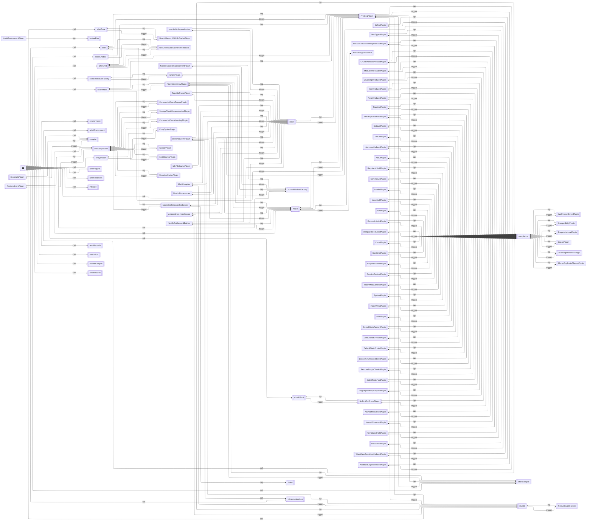

```mermaid
---
config:
  layout: elk
  elk:
    nodePlacementStrategy: NETWORK_SIMPLEX
---
graph LR
  node0[[ next-build-dependencies ]] -->|tap| node1[[ done ]]
  node2[[ ProfilingPlugin ]] -->|tap| node1[[ done ]]
  node3[[ NextJsMemoryWithGcCachePlugin ]] -->|tap| node4[[ afterDone ]]
  node5[[ NodeEnvironmentPlugin ]] -->|tap| node6[[ beforeRun ]]
  node2[[ ProfilingPlugin ]] -->|tap| node7[[ emit ]]
  node8[[ NextJsRequireCacheHotReloader ]] -->|tap| node9[[ assetEmitted ]]
  node8[[ NextJsRequireCacheHotReloader ]] -->|tap| node10[[ afterEmit ]]
  node2[[ ProfilingPlugin ]] -->|tap| node10[[ afterEmit ]]
  node2[[ ProfilingPlugin ]] -->|tap| node11[[ compilation ]]
  node12[[ DefinePlugin ]] -->|tap| node11[[ compilation ]]
  node13[[ WellKnownErrorsPlugin ]] -->|tap| node11[[ compilation ]]
  node14[[ NextTypesPlugin ]] -->|tap| node11[[ compilation ]]
  node15[[ NextJSEvalSourceMapDevToolPlugin ]] -->|tap| node11[[ compilation ]]
  node16[[ NormalModuleReplacementPlugin ]] -->|tap| node17[[ normalModuleFactory ]]
  node18[[ IgnorePlugin ]] -->|tap| node17[[ normalModuleFactory ]]
  node18[[ IgnorePlugin ]] -->|tap| node19[[ contextModuleFactory ]]
  node2[[ ProfilingPlugin ]] -->|tap| node20[[ make ]]
  node21[[ NextJsPagesManifest ]] -->|tap| node20[[ make ]]
  node22[[ FlightClientEntryPlugin ]] -->|tap| node20[[ make ]]
  node22[[ FlightClientEntryPlugin ]] -->|tap| node23[[ finishMake ]]
  node2[[ ProfilingPlugin ]] -->|tap| node23[[ finishMake ]]
  node22[[ FlightClientEntryPlugin ]] -->|tap| node24[[ afterCompile ]]
  node2[[ ProfilingPlugin ]] -->|tap| node24[[ afterCompile ]]
  node2[[ ProfilingPlugin ]] -->|tap| node25[[ invalid ]]
  node26[[ TapableTracerPlugin ]] -->|tap| node1[[ done ]]
  node27[[ ⬤ ]] -->|call| node28[[ environment ]]
  node27[[ ⬤ ]] -->|call| node29[[ afterEnvironment ]]
  node30[[ ExternalsPlugin ]] -->|tap| node31[[ compile ]]
  node32[[ ChunkPrefetchPreloadPlugin ]] -->|tap| node11[[ compilation ]]
  node33[[ CommonJsChunkFormatPlugin ]] -->|tap| node34[[ thisCompilation ]]
  node35[[ StartupChunkDependenciesPlugin ]] -->|tap| node34[[ thisCompilation ]]
  node36[[ CommonJsChunkLoadingPlugin ]] -->|tap| node34[[ thisCompilation ]]
  node37[[ AssignLibraryPlugin ]] -->|tap| node34[[ thisCompilation ]]
  node38[[ ModuleInfoHeaderPlugin ]] -->|tap| node11[[ compilation ]]
  node39[[ JavascriptModulesPlugin ]] -->|tap| node11[[ compilation ]]
  node40[[ JsonModulesPlugin ]] -->|tap| node11[[ compilation ]]
  node41[[ AssetModulesPlugin ]] -->|tap| node11[[ compilation ]]
  node42[[ EntryOptionPlugin ]] -->|tap| node43[[ entryOption ]]
  node27[[ ⬤ ]] -->|call| node43[[ entryOption ]]
  node43[[ entryOption ]] -->|trigger| node42[[ EntryOptionPlugin ]]
  node44[[ DynamicEntryPlugin ]] -->|tap| node11[[ compilation ]]
  node44[[ DynamicEntryPlugin ]] -->|tap| node20[[ make ]]
  node45[[ RuntimePlugin ]] -->|tap| node11[[ compilation ]]
  node46[[ InferAsyncModulesPlugin ]] -->|tap| node11[[ compilation ]]
  node47[[ DataUriPlugin ]] -->|tap| node11[[ compilation ]]
  node48[[ FileUriPlugin ]] -->|tap| node11[[ compilation ]]
  node49[[ CompatibilityPlugin ]] -->|tap| node11[[ compilation ]]
  node50[[ HarmonyModulesPlugin ]] -->|tap| node11[[ compilation ]]
  node51[[ AMDPlugin ]] -->|tap| node11[[ compilation ]]
  node52[[ RequireJsStuffPlugin ]] -->|tap| node11[[ compilation ]]
  node53[[ CommonJsPlugin ]] -->|tap| node11[[ compilation ]]
  node54[[ LoaderPlugin ]] -->|tap| node11[[ compilation ]]
  node55[[ NodeStuffPlugin ]] -->|tap| node11[[ compilation ]]
  node56[[ APIPlugin ]] -->|tap| node11[[ compilation ]]
  node57[[ ExportsInfoApiPlugin ]] -->|tap| node11[[ compilation ]]
  node58[[ WebpackIsIncludedPlugin ]] -->|tap| node11[[ compilation ]]
  node59[[ ConstPlugin ]] -->|tap| node11[[ compilation ]]
  node60[[ UseStrictPlugin ]] -->|tap| node11[[ compilation ]]
  node61[[ RequireIncludePlugin ]] -->|tap| node11[[ compilation ]]
  node62[[ RequireEnsurePlugin ]] -->|tap| node11[[ compilation ]]
  node63[[ RequireContextPlugin ]] -->|tap| node11[[ compilation ]]
  node64[[ ImportPlugin ]] -->|tap| node11[[ compilation ]]
  node65[[ ImportMetaContextPlugin ]] -->|tap| node11[[ compilation ]]
  node66[[ SystemPlugin ]] -->|tap| node11[[ compilation ]]
  node67[[ ImportMetaPlugin ]] -->|tap| node11[[ compilation ]]
  node68[[ URLPlugin ]] -->|tap| node11[[ compilation ]]
  node69[[ WorkerPlugin ]] -->|tap| node34[[ thisCompilation ]]
  node70[[ DefaultStatsFactoryPlugin ]] -->|tap| node11[[ compilation ]]
  node71[[ DefaultStatsPresetPlugin ]] -->|tap| node11[[ compilation ]]
  node72[[ DefaultStatsPrinterPlugin ]] -->|tap| node11[[ compilation ]]
  node73[[ JavascriptMetaInfoPlugin ]] -->|tap| node11[[ compilation ]]
  node74[[ EnsureChunkConditionsPlugin ]] -->|tap| node11[[ compilation ]]
  node75[[ RemoveEmptyChunksPlugin ]] -->|tap| node11[[ compilation ]]
  node76[[ MergeDuplicateChunksPlugin ]] -->|tap| node11[[ compilation ]]
  node77[[ SideEffectsFlagPlugin ]] -->|tap| node11[[ compilation ]]
  node78[[ FlagDependencyExportsPlugin ]] -->|tap| node11[[ compilation ]]
  node79[[ SplitChunksPlugin ]] -->|tap| node34[[ thisCompilation ]]
  node80[[ NoEmitOnErrorsPlugin ]] -->|tap| node81[[ shouldEmit ]]
  node80[[ NoEmitOnErrorsPlugin ]] -->|tap| node11[[ compilation ]]
  node82[[ NamedModuleIdsPlugin ]] -->|tap| node11[[ compilation ]]
  node83[[ NamedChunkIdsPlugin ]] -->|tap| node11[[ compilation ]]
  node84[[ TemplatedPathPlugin ]] -->|tap| node11[[ compilation ]]
  node85[[ RecordIdsPlugin ]] -->|tap| node11[[ compilation ]]
  node86[[ WarnCaseSensitiveModulesPlugin ]] -->|tap| node11[[ compilation ]]
  node87[[ AddBuildDependenciesPlugin ]] -->|tap| node11[[ compilation ]]
  node88[[ IdleFileCachePlugin ]] -->|tap| node1[[ done ]]
  node89[[ ResolverCachePlugin ]] -->|tap| node34[[ thisCompilation ]]
  node27[[ ⬤ ]] -->|call| node90[[ afterPlugins ]]
  node27[[ ⬤ ]] -->|call| node91[[ afterResolvers ]]
  node27[[ ⬤ ]] -->|call| node92[[ initialize ]]
  node93[[ MultiCompiler ]] -->|tap| node1[[ done ]]
  node93[[ MultiCompiler ]] -->|tap| node25[[ invalid ]]
  node94[[ NextJsInvalid-server ]] -->|tap| node25[[ invalid ]]
  node95[[ NextJsDone-server ]] -->|tap| node1[[ done ]]
  node96[[ NextjsHotReloaderForServer ]] -->|tap| node7[[ emit ]]
  node96[[ NextjsHotReloaderForServer ]] -->|tap| node97[[ failed ]]
  node96[[ NextjsHotReloaderForServer ]] -->|tap| node1[[ done ]]
  node98[[ webpack-hot-middleware ]] -->|tap| node25[[ invalid ]]
  node98[[ webpack-hot-middleware ]] -->|tap| node1[[ done ]]
  node27[[ ⬤ ]] -->|call| node99[[ infrastructureLog ]]
  node27[[ ⬤ ]] -->|call| node100[[ readRecords ]]
  node27[[ ⬤ ]] -->|call| node101[[ watchRun ]]
  node27[[ ⬤ ]] -->|call| node17[[ normalModuleFactory ]]
  node17[[ normalModuleFactory ]] -->|trigger| node16[[ NormalModuleReplacementPlugin ]]
  node17[[ normalModuleFactory ]] -->|trigger| node18[[ IgnorePlugin ]]
  node27[[ ⬤ ]] -->|call| node19[[ contextModuleFactory ]]
  node19[[ contextModuleFactory ]] -->|trigger| node18[[ IgnorePlugin ]]
  node27[[ ⬤ ]] -->|call| node102[[ beforeCompile ]]
  node27[[ ⬤ ]] -->|call| node31[[ compile ]]
  node31[[ compile ]] -->|trigger| node30[[ ExternalsPlugin ]]
  node27[[ ⬤ ]] -->|call| node34[[ thisCompilation ]]
  node34[[ thisCompilation ]] -->|trigger| node33[[ CommonJsChunkFormatPlugin ]]
  node34[[ thisCompilation ]] -->|trigger| node35[[ StartupChunkDependenciesPlugin ]]
  node34[[ thisCompilation ]] -->|trigger| node36[[ CommonJsChunkLoadingPlugin ]]
  node34[[ thisCompilation ]] -->|trigger| node37[[ AssignLibraryPlugin ]]
  node34[[ thisCompilation ]] -->|trigger| node69[[ WorkerPlugin ]]
  node34[[ thisCompilation ]] -->|trigger| node79[[ SplitChunksPlugin ]]
  node34[[ thisCompilation ]] -->|trigger| node89[[ ResolverCachePlugin ]]
  node27[[ ⬤ ]] -->|call| node11[[ compilation ]]
  node11[[ compilation ]] -->|trigger| node2[[ ProfilingPlugin ]]
  node11[[ compilation ]] -->|trigger| node12[[ DefinePlugin ]]
  node11[[ compilation ]] -->|trigger| node13[[ WellKnownErrorsPlugin ]]
  node11[[ compilation ]] -->|trigger| node14[[ NextTypesPlugin ]]
  node11[[ compilation ]] -->|trigger| node15[[ NextJSEvalSourceMapDevToolPlugin ]]
  node11[[ compilation ]] -->|trigger| node32[[ ChunkPrefetchPreloadPlugin ]]
  node11[[ compilation ]] -->|trigger| node38[[ ModuleInfoHeaderPlugin ]]
  node11[[ compilation ]] -->|trigger| node39[[ JavascriptModulesPlugin ]]
  node11[[ compilation ]] -->|trigger| node40[[ JsonModulesPlugin ]]
  node11[[ compilation ]] -->|trigger| node41[[ AssetModulesPlugin ]]
  node11[[ compilation ]] -->|trigger| node44[[ DynamicEntryPlugin ]]
  node11[[ compilation ]] -->|trigger| node45[[ RuntimePlugin ]]
  node11[[ compilation ]] -->|trigger| node46[[ InferAsyncModulesPlugin ]]
  node11[[ compilation ]] -->|trigger| node47[[ DataUriPlugin ]]
  node11[[ compilation ]] -->|trigger| node48[[ FileUriPlugin ]]
  node11[[ compilation ]] -->|trigger| node49[[ CompatibilityPlugin ]]
  node11[[ compilation ]] -->|trigger| node50[[ HarmonyModulesPlugin ]]
  node11[[ compilation ]] -->|trigger| node51[[ AMDPlugin ]]
  node11[[ compilation ]] -->|trigger| node52[[ RequireJsStuffPlugin ]]
  node11[[ compilation ]] -->|trigger| node53[[ CommonJsPlugin ]]
  node11[[ compilation ]] -->|trigger| node54[[ LoaderPlugin ]]
  node11[[ compilation ]] -->|trigger| node55[[ NodeStuffPlugin ]]
  node11[[ compilation ]] -->|trigger| node56[[ APIPlugin ]]
  node11[[ compilation ]] -->|trigger| node57[[ ExportsInfoApiPlugin ]]
  node11[[ compilation ]] -->|trigger| node58[[ WebpackIsIncludedPlugin ]]
  node11[[ compilation ]] -->|trigger| node59[[ ConstPlugin ]]
  node11[[ compilation ]] -->|trigger| node60[[ UseStrictPlugin ]]
  node11[[ compilation ]] -->|trigger| node61[[ RequireIncludePlugin ]]
  node11[[ compilation ]] -->|trigger| node62[[ RequireEnsurePlugin ]]
  node11[[ compilation ]] -->|trigger| node63[[ RequireContextPlugin ]]
  node11[[ compilation ]] -->|trigger| node64[[ ImportPlugin ]]
  node11[[ compilation ]] -->|trigger| node65[[ ImportMetaContextPlugin ]]
  node11[[ compilation ]] -->|trigger| node66[[ SystemPlugin ]]
  node11[[ compilation ]] -->|trigger| node67[[ ImportMetaPlugin ]]
  node11[[ compilation ]] -->|trigger| node68[[ URLPlugin ]]
  node11[[ compilation ]] -->|trigger| node70[[ DefaultStatsFactoryPlugin ]]
  node11[[ compilation ]] -->|trigger| node71[[ DefaultStatsPresetPlugin ]]
  node11[[ compilation ]] -->|trigger| node72[[ DefaultStatsPrinterPlugin ]]
  node11[[ compilation ]] -->|trigger| node73[[ JavascriptMetaInfoPlugin ]]
  node11[[ compilation ]] -->|trigger| node74[[ EnsureChunkConditionsPlugin ]]
  node11[[ compilation ]] -->|trigger| node75[[ RemoveEmptyChunksPlugin ]]
  node11[[ compilation ]] -->|trigger| node76[[ MergeDuplicateChunksPlugin ]]
  node11[[ compilation ]] -->|trigger| node77[[ SideEffectsFlagPlugin ]]
  node11[[ compilation ]] -->|trigger| node78[[ FlagDependencyExportsPlugin ]]
  node11[[ compilation ]] -->|trigger| node80[[ NoEmitOnErrorsPlugin ]]
  node11[[ compilation ]] -->|trigger| node82[[ NamedModuleIdsPlugin ]]
  node11[[ compilation ]] -->|trigger| node83[[ NamedChunkIdsPlugin ]]
  node11[[ compilation ]] -->|trigger| node84[[ TemplatedPathPlugin ]]
  node11[[ compilation ]] -->|trigger| node85[[ RecordIdsPlugin ]]
  node11[[ compilation ]] -->|trigger| node86[[ WarnCaseSensitiveModulesPlugin ]]
  node11[[ compilation ]] -->|trigger| node87[[ AddBuildDependenciesPlugin ]]
  node27[[ ⬤ ]] -->|call| node20[[ make ]]
  node20[[ make ]] -->|trigger| node2[[ ProfilingPlugin ]]
  node20[[ make ]] -->|trigger| node21[[ NextJsPagesManifest ]]
  node20[[ make ]] -->|trigger| node22[[ FlightClientEntryPlugin ]]
  node20[[ make ]] -->|trigger| node44[[ DynamicEntryPlugin ]]
  node27[[ ⬤ ]] -->|call| node23[[ finishMake ]]
  node23[[ finishMake ]] -->|trigger| node22[[ FlightClientEntryPlugin ]]
  node23[[ finishMake ]] -->|trigger| node2[[ ProfilingPlugin ]]
  node27[[ ⬤ ]] -->|call| node24[[ afterCompile ]]
  node24[[ afterCompile ]] -->|trigger| node22[[ FlightClientEntryPlugin ]]
  node24[[ afterCompile ]] -->|trigger| node2[[ ProfilingPlugin ]]
  node27[[ ⬤ ]] -->|call| node81[[ shouldEmit ]]
  node81[[ shouldEmit ]] -->|trigger| node80[[ NoEmitOnErrorsPlugin ]]
  node27[[ ⬤ ]] -->|call| node7[[ emit ]]
  node7[[ emit ]] -->|trigger| node2[[ ProfilingPlugin ]]
  node7[[ emit ]] -->|trigger| node96[[ NextjsHotReloaderForServer ]]
  node27[[ ⬤ ]] -->|call| node9[[ assetEmitted ]]
  node9[[ assetEmitted ]] -->|trigger| node8[[ NextJsRequireCacheHotReloader ]]
  node27[[ ⬤ ]] -->|call| node10[[ afterEmit ]]
  node10[[ afterEmit ]] -->|trigger| node8[[ NextJsRequireCacheHotReloader ]]
  node10[[ afterEmit ]] -->|trigger| node2[[ ProfilingPlugin ]]
  node27[[ ⬤ ]] -->|call| node103[[ emitRecords ]]
  node27[[ ⬤ ]] -->|call| node1[[ done ]]
  node1[[ done ]] -->|trigger| node0[[ next-build-dependencies ]]
  node1[[ done ]] -->|trigger| node88[[ IdleFileCachePlugin ]]
  node1[[ done ]] -->|trigger| node93[[ MultiCompiler ]]
  node1[[ done ]] -->|trigger| node95[[ NextJsDone-server ]]
  node1[[ done ]] -->|trigger| node96[[ NextjsHotReloaderForServer ]]
  node1[[ done ]] -->|trigger| node98[[ webpack-hot-middleware ]]
  node1[[ done ]] -->|trigger| node2[[ ProfilingPlugin ]]
  node1[[ done ]] -->|trigger| node26[[ TapableTracerPlugin ]]
  node27[[ ⬤ ]] -->|call| node4[[ afterDone ]]
  node4[[ afterDone ]] -->|trigger| node3[[ NextJsMemoryWithGcCachePlugin ]]
  node104[[ NextJsOnDemandEntries ]] -->|tap| node20[[ make ]]
  node104[[ NextJsOnDemandEntries ]] -->|tap| node1[[ done ]]
  node27[[ ⬤ ]] -->|call| node25[[ invalid ]]
  node25[[ invalid ]] -->|trigger| node2[[ ProfilingPlugin ]]
  node25[[ invalid ]] -->|trigger| node93[[ MultiCompiler ]]
  node25[[ invalid ]] -->|trigger| node94[[ NextJsInvalid-server ]]
  node25[[ invalid ]] -->|trigger| node98[[ webpack-hot-middleware ]]
  node20[[ make ]] -->|trigger| node104[[ NextJsOnDemandEntries ]]
  node1[[ done ]] -->|trigger| node104[[ NextJsOnDemandEntries ]]
  node44[[ DynamicEntryPlugin ]] -->|call| node99[[ infrastructureLog ]]
```