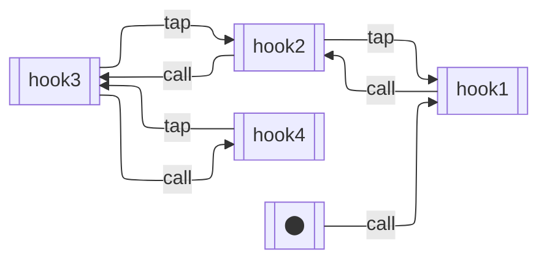

```mermaid
---
config:
  layout: elk
  elk:
    nodePlacementStrategy: NETWORK_SIMPLEX
---
graph LR
  node0[[ hook2 ]] -->|tap| node1[[ hook1 ]]
  node2[[ hook3 ]] -->|tap| node0[[ hook2 ]]
  node3[[ hook4 ]] -->|tap| node2[[ hook3 ]]
  node4[[ ⬤ ]] -->|call| node1[[ hook1 ]]
  node1[[ hook1 ]] -->|call| node0[[ hook2 ]]
  node0[[ hook2 ]] -->|call| node2[[ hook3 ]]
  node2[[ hook3 ]] -->|call| node3[[ hook4 ]]
```