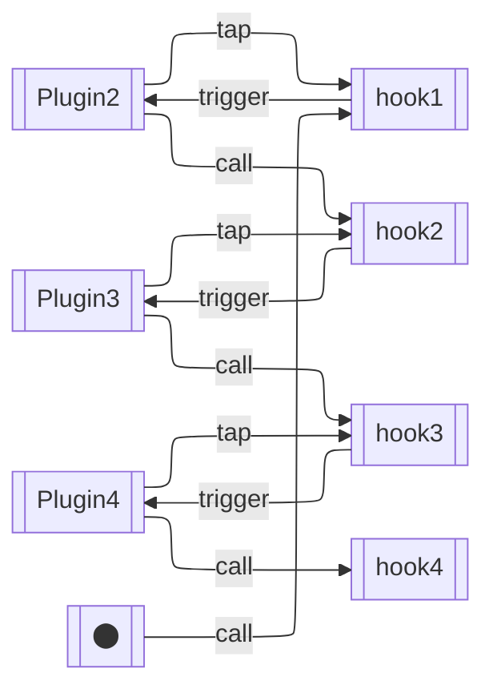

```mermaid
---
config:
  layout: elk
  elk:
    nodePlacementStrategy: NETWORK_SIMPLEX
---
graph LR
  node0[[ Plugin2 ]] -->|tap| node1[[ hook1 ]]
  node2[[ Plugin3 ]] -->|tap| node3[[ hook2 ]]
  node4[[ Plugin4 ]] -->|tap| node5[[ hook3 ]]
  node6[[ ⬤ ]] -->|call| node1[[ hook1 ]]
  node1[[ hook1 ]] -->|trigger| node0[[ Plugin2 ]]
  node0[[ Plugin2 ]] -->|call| node3[[ hook2 ]]
  node3[[ hook2 ]] -->|trigger| node2[[ Plugin3 ]]
  node2[[ Plugin3 ]] -->|call| node5[[ hook3 ]]
  node5[[ hook3 ]] -->|trigger| node4[[ Plugin4 ]]
  node4[[ Plugin4 ]] -->|call| node7[[ hook4 ]]
```