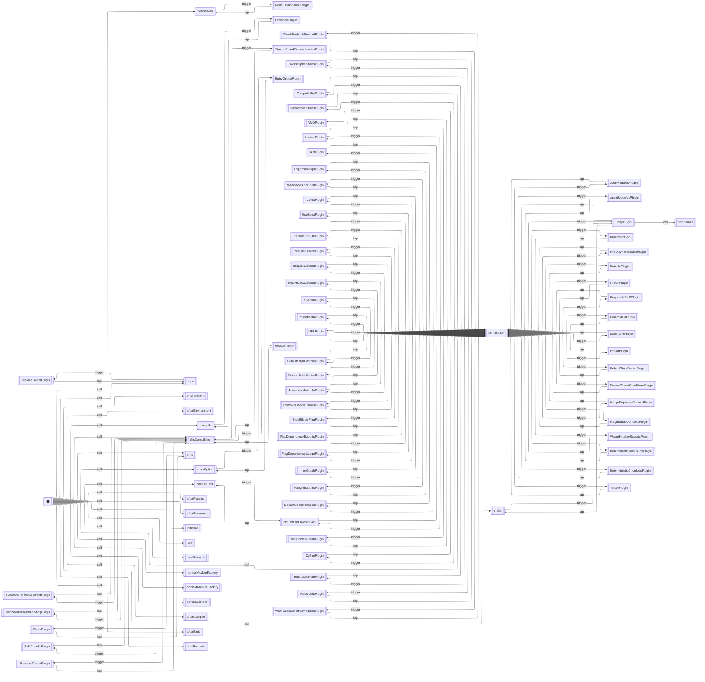

```mermaid
---
config:
  layout: elk
  elk:
    nodePlacementStrategy: NETWORK_SIMPLEX
---
graph LR
  node0[[ NodeEnvironmentPlugin ]] -->|tap| node1[[ beforeRun ]]
  node2[[ TapableTracerPlugin ]] -->|tap| node3[[ done ]]
  node4[[ ⬤ ]] -->|call| node5[[ environment ]]
  node4[[ ⬤ ]] -->|call| node6[[ afterEnvironment ]]
  node7[[ ExternalsPlugin ]] -->|tap| node8[[ compile ]]
  node9[[ ChunkPrefetchPreloadPlugin ]] -->|tap| node10[[ compilation ]]
  node11[[ CommonJsChunkFormatPlugin ]] -->|tap| node12[[ thisCompilation ]]
  node13[[ StartupChunkDependenciesPlugin ]] -->|tap| node12[[ thisCompilation ]]
  node14[[ CommonJsChunkLoadingPlugin ]] -->|tap| node12[[ thisCompilation ]]
  node15[[ CleanPlugin ]] -->|tap| node16[[ emit ]]
  node17[[ JavascriptModulesPlugin ]] -->|tap| node10[[ compilation ]]
  node18[[ JsonModulesPlugin ]] -->|tap| node10[[ compilation ]]
  node19[[ AssetModulesPlugin ]] -->|tap| node10[[ compilation ]]
  node20[[ EntryOptionPlugin ]] -->|tap| node21[[ entryOption ]]
  node4[[ ⬤ ]] -->|call| node21[[ entryOption ]]
  node21[[ entryOption ]] -->|trigger| node20[[ EntryOptionPlugin ]]
  node22[[ EntryPlugin ]] -->|tap| node10[[ compilation ]]
  node22[[ EntryPlugin ]] -->|tap| node23[[ make ]]
  node24[[ RuntimePlugin ]] -->|tap| node10[[ compilation ]]
  node25[[ InferAsyncModulesPlugin ]] -->|tap| node10[[ compilation ]]
  node26[[ DataUriPlugin ]] -->|tap| node10[[ compilation ]]
  node27[[ FileUriPlugin ]] -->|tap| node10[[ compilation ]]
  node28[[ CompatibilityPlugin ]] -->|tap| node10[[ compilation ]]
  node29[[ HarmonyModulesPlugin ]] -->|tap| node10[[ compilation ]]
  node30[[ AMDPlugin ]] -->|tap| node10[[ compilation ]]
  node31[[ RequireJsStuffPlugin ]] -->|tap| node10[[ compilation ]]
  node32[[ CommonJsPlugin ]] -->|tap| node10[[ compilation ]]
  node33[[ LoaderPlugin ]] -->|tap| node10[[ compilation ]]
  node34[[ NodeStuffPlugin ]] -->|tap| node10[[ compilation ]]
  node35[[ APIPlugin ]] -->|tap| node10[[ compilation ]]
  node36[[ ExportsInfoApiPlugin ]] -->|tap| node10[[ compilation ]]
  node37[[ WebpackIsIncludedPlugin ]] -->|tap| node10[[ compilation ]]
  node38[[ ConstPlugin ]] -->|tap| node10[[ compilation ]]
  node39[[ UseStrictPlugin ]] -->|tap| node10[[ compilation ]]
  node40[[ RequireIncludePlugin ]] -->|tap| node10[[ compilation ]]
  node41[[ RequireEnsurePlugin ]] -->|tap| node10[[ compilation ]]
  node42[[ RequireContextPlugin ]] -->|tap| node10[[ compilation ]]
  node43[[ ImportPlugin ]] -->|tap| node10[[ compilation ]]
  node44[[ ImportMetaContextPlugin ]] -->|tap| node10[[ compilation ]]
  node45[[ SystemPlugin ]] -->|tap| node10[[ compilation ]]
  node46[[ ImportMetaPlugin ]] -->|tap| node10[[ compilation ]]
  node47[[ URLPlugin ]] -->|tap| node10[[ compilation ]]
  node48[[ WorkerPlugin ]] -->|tap| node12[[ thisCompilation ]]
  node49[[ DefaultStatsFactoryPlugin ]] -->|tap| node10[[ compilation ]]
  node50[[ DefaultStatsPresetPlugin ]] -->|tap| node10[[ compilation ]]
  node51[[ DefaultStatsPrinterPlugin ]] -->|tap| node10[[ compilation ]]
  node52[[ JavascriptMetaInfoPlugin ]] -->|tap| node10[[ compilation ]]
  node53[[ EnsureChunkConditionsPlugin ]] -->|tap| node10[[ compilation ]]
  node54[[ RemoveEmptyChunksPlugin ]] -->|tap| node10[[ compilation ]]
  node55[[ MergeDuplicateChunksPlugin ]] -->|tap| node10[[ compilation ]]
  node56[[ FlagIncludedChunksPlugin ]] -->|tap| node10[[ compilation ]]
  node57[[ SideEffectsFlagPlugin ]] -->|tap| node10[[ compilation ]]
  node58[[ FlagDependencyExportsPlugin ]] -->|tap| node10[[ compilation ]]
  node59[[ FlagDependencyUsagePlugin ]] -->|tap| node10[[ compilation ]]
  node60[[ InnerGraphPlugin ]] -->|tap| node10[[ compilation ]]
  node61[[ MangleExportsPlugin ]] -->|tap| node10[[ compilation ]]
  node62[[ ModuleConcatenationPlugin ]] -->|tap| node10[[ compilation ]]
  node63[[ SplitChunksPlugin ]] -->|tap| node12[[ thisCompilation ]]
  node64[[ NoEmitOnErrorsPlugin ]] -->|tap| node65[[ shouldEmit ]]
  node64[[ NoEmitOnErrorsPlugin ]] -->|tap| node10[[ compilation ]]
  node66[[ RealContentHashPlugin ]] -->|tap| node10[[ compilation ]]
  node67[[ WasmFinalizeExportsPlugin ]] -->|tap| node10[[ compilation ]]
  node68[[ DeterministicModuleIdsPlugin ]] -->|tap| node10[[ compilation ]]
  node69[[ DeterministicChunkIdsPlugin ]] -->|tap| node10[[ compilation ]]
  node70[[ DefinePlugin ]] -->|tap| node10[[ compilation ]]
  node71[[ TerserPlugin ]] -->|tap| node10[[ compilation ]]
  node72[[ TemplatedPathPlugin ]] -->|tap| node10[[ compilation ]]
  node73[[ RecordIdsPlugin ]] -->|tap| node10[[ compilation ]]
  node74[[ WarnCaseSensitiveModulesPlugin ]] -->|tap| node10[[ compilation ]]
  node75[[ ResolverCachePlugin ]] -->|tap| node12[[ thisCompilation ]]
  node4[[ ⬤ ]] -->|call| node76[[ afterPlugins ]]
  node4[[ ⬤ ]] -->|call| node77[[ afterResolvers ]]
  node4[[ ⬤ ]] -->|call| node78[[ initialize ]]
  node4[[ ⬤ ]] -->|call| node1[[ beforeRun ]]
  node1[[ beforeRun ]] -->|trigger| node0[[ NodeEnvironmentPlugin ]]
  node4[[ ⬤ ]] -->|call| node79[[ run ]]
  node4[[ ⬤ ]] -->|call| node80[[ readRecords ]]
  node4[[ ⬤ ]] -->|call| node81[[ normalModuleFactory ]]
  node4[[ ⬤ ]] -->|call| node82[[ contextModuleFactory ]]
  node4[[ ⬤ ]] -->|call| node83[[ beforeCompile ]]
  node4[[ ⬤ ]] -->|call| node8[[ compile ]]
  node8[[ compile ]] -->|trigger| node7[[ ExternalsPlugin ]]
  node4[[ ⬤ ]] -->|call| node12[[ thisCompilation ]]
  node12[[ thisCompilation ]] -->|trigger| node11[[ CommonJsChunkFormatPlugin ]]
  node12[[ thisCompilation ]] -->|trigger| node13[[ StartupChunkDependenciesPlugin ]]
  node12[[ thisCompilation ]] -->|trigger| node14[[ CommonJsChunkLoadingPlugin ]]
  node12[[ thisCompilation ]] -->|trigger| node48[[ WorkerPlugin ]]
  node12[[ thisCompilation ]] -->|trigger| node63[[ SplitChunksPlugin ]]
  node12[[ thisCompilation ]] -->|trigger| node75[[ ResolverCachePlugin ]]
  node4[[ ⬤ ]] -->|call| node10[[ compilation ]]
  node10[[ compilation ]] -->|trigger| node9[[ ChunkPrefetchPreloadPlugin ]]
  node10[[ compilation ]] -->|trigger| node17[[ JavascriptModulesPlugin ]]
  node10[[ compilation ]] -->|trigger| node18[[ JsonModulesPlugin ]]
  node10[[ compilation ]] -->|trigger| node19[[ AssetModulesPlugin ]]
  node10[[ compilation ]] -->|trigger| node22[[ EntryPlugin ]]
  node10[[ compilation ]] -->|trigger| node24[[ RuntimePlugin ]]
  node10[[ compilation ]] -->|trigger| node25[[ InferAsyncModulesPlugin ]]
  node10[[ compilation ]] -->|trigger| node26[[ DataUriPlugin ]]
  node10[[ compilation ]] -->|trigger| node27[[ FileUriPlugin ]]
  node10[[ compilation ]] -->|trigger| node28[[ CompatibilityPlugin ]]
  node10[[ compilation ]] -->|trigger| node29[[ HarmonyModulesPlugin ]]
  node10[[ compilation ]] -->|trigger| node30[[ AMDPlugin ]]
  node10[[ compilation ]] -->|trigger| node31[[ RequireJsStuffPlugin ]]
  node10[[ compilation ]] -->|trigger| node32[[ CommonJsPlugin ]]
  node10[[ compilation ]] -->|trigger| node33[[ LoaderPlugin ]]
  node10[[ compilation ]] -->|trigger| node34[[ NodeStuffPlugin ]]
  node10[[ compilation ]] -->|trigger| node35[[ APIPlugin ]]
  node10[[ compilation ]] -->|trigger| node36[[ ExportsInfoApiPlugin ]]
  node10[[ compilation ]] -->|trigger| node37[[ WebpackIsIncludedPlugin ]]
  node10[[ compilation ]] -->|trigger| node38[[ ConstPlugin ]]
  node10[[ compilation ]] -->|trigger| node39[[ UseStrictPlugin ]]
  node10[[ compilation ]] -->|trigger| node40[[ RequireIncludePlugin ]]
  node10[[ compilation ]] -->|trigger| node41[[ RequireEnsurePlugin ]]
  node10[[ compilation ]] -->|trigger| node42[[ RequireContextPlugin ]]
  node10[[ compilation ]] -->|trigger| node43[[ ImportPlugin ]]
  node10[[ compilation ]] -->|trigger| node44[[ ImportMetaContextPlugin ]]
  node10[[ compilation ]] -->|trigger| node45[[ SystemPlugin ]]
  node10[[ compilation ]] -->|trigger| node46[[ ImportMetaPlugin ]]
  node10[[ compilation ]] -->|trigger| node47[[ URLPlugin ]]
  node10[[ compilation ]] -->|trigger| node49[[ DefaultStatsFactoryPlugin ]]
  node10[[ compilation ]] -->|trigger| node50[[ DefaultStatsPresetPlugin ]]
  node10[[ compilation ]] -->|trigger| node51[[ DefaultStatsPrinterPlugin ]]
  node10[[ compilation ]] -->|trigger| node52[[ JavascriptMetaInfoPlugin ]]
  node10[[ compilation ]] -->|trigger| node53[[ EnsureChunkConditionsPlugin ]]
  node10[[ compilation ]] -->|trigger| node54[[ RemoveEmptyChunksPlugin ]]
  node10[[ compilation ]] -->|trigger| node55[[ MergeDuplicateChunksPlugin ]]
  node10[[ compilation ]] -->|trigger| node56[[ FlagIncludedChunksPlugin ]]
  node10[[ compilation ]] -->|trigger| node57[[ SideEffectsFlagPlugin ]]
  node10[[ compilation ]] -->|trigger| node58[[ FlagDependencyExportsPlugin ]]
  node10[[ compilation ]] -->|trigger| node59[[ FlagDependencyUsagePlugin ]]
  node10[[ compilation ]] -->|trigger| node60[[ InnerGraphPlugin ]]
  node10[[ compilation ]] -->|trigger| node61[[ MangleExportsPlugin ]]
  node10[[ compilation ]] -->|trigger| node62[[ ModuleConcatenationPlugin ]]
  node10[[ compilation ]] -->|trigger| node64[[ NoEmitOnErrorsPlugin ]]
  node10[[ compilation ]] -->|trigger| node66[[ RealContentHashPlugin ]]
  node10[[ compilation ]] -->|trigger| node67[[ WasmFinalizeExportsPlugin ]]
  node10[[ compilation ]] -->|trigger| node68[[ DeterministicModuleIdsPlugin ]]
  node10[[ compilation ]] -->|trigger| node69[[ DeterministicChunkIdsPlugin ]]
  node10[[ compilation ]] -->|trigger| node70[[ DefinePlugin ]]
  node10[[ compilation ]] -->|trigger| node71[[ TerserPlugin ]]
  node10[[ compilation ]] -->|trigger| node72[[ TemplatedPathPlugin ]]
  node10[[ compilation ]] -->|trigger| node73[[ RecordIdsPlugin ]]
  node10[[ compilation ]] -->|trigger| node74[[ WarnCaseSensitiveModulesPlugin ]]
  node4[[ ⬤ ]] -->|call| node23[[ make ]]
  node23[[ make ]] -->|trigger| node22[[ EntryPlugin ]]
  node22[[ EntryPlugin ]] -->|call| node84[[ finishMake ]]
  node4[[ ⬤ ]] -->|call| node85[[ afterCompile ]]
  node4[[ ⬤ ]] -->|call| node65[[ shouldEmit ]]
  node65[[ shouldEmit ]] -->|trigger| node64[[ NoEmitOnErrorsPlugin ]]
  node4[[ ⬤ ]] -->|call| node16[[ emit ]]
  node16[[ emit ]] -->|trigger| node15[[ CleanPlugin ]]
  node4[[ ⬤ ]] -->|call| node86[[ afterEmit ]]
  node4[[ ⬤ ]] -->|call| node87[[ emitRecords ]]
  node4[[ ⬤ ]] -->|call| node3[[ done ]]
  node3[[ done ]] -->|trigger| node2[[ TapableTracerPlugin ]]
```